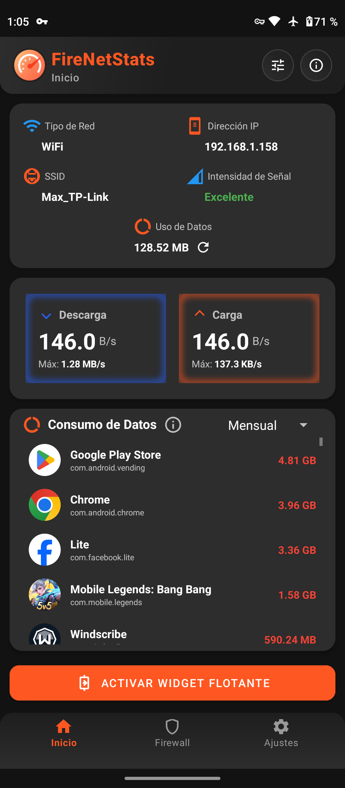
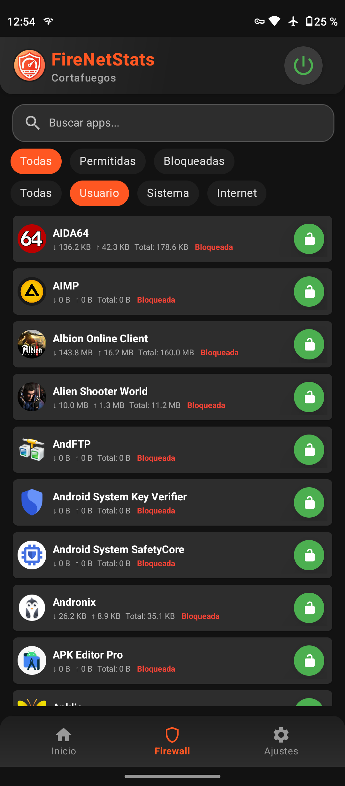
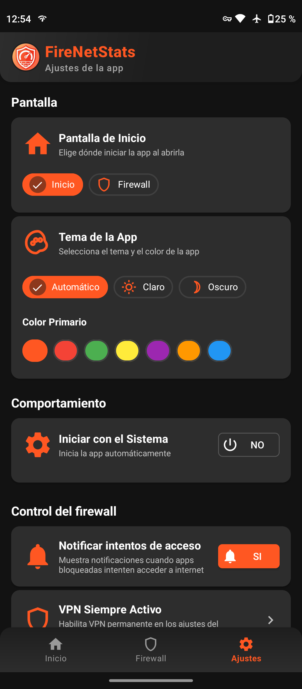

#  FireNetStats 🔥📊  
**Monitor de Red y Firewall en Tiempo Real para Android**  

<div align="center">

[](https://www.android.com/)
[](https://kotlinlang.org/)
[](https://m3.material.io/)
[](LICENSE)

</div>

---

## 📱 Descripción  
**FireNetStats** es una aplicación Android profesional y elegante que combina monitoreo de red en tiempo real con un potente sistema de firewall personalizable. Con una interfaz moderna Material Design 3, widget flotante configurable y análisis detallado de conexiones, mantén el control total de tu red y datos.

---

## ✨ Características Principales  

### 🎯 **Monitoreo de Red en Tiempo Real**  
- ⚡ Velocidades de descarga y carga actualizadas en tiempo real
- 📊 Historial gráfico interactivo de velocidades
- 📡 Información detallada de conexiones (WiFi/Datos móviles)
- 📶 Intensidad de señal y estado de la red
- 🔍 Detalles avanzados
- 📈 Estadísticas por segundo, minuto, hora y día

### 🎨 **Widget Flotante Avanzado**  
- **Tamaños personalizables:** Pequeño, Mediano, Grande
- **Transparencia ajustable:** 0% a 100%
- **Colores customizados:** Fondo, texto, iconos y flechas
- **Información flexible:** Solo ↓, solo ↑, o ambas velocidades
- **Posición libre:** Arrastra libremente por la pantalla
- **Actualizaciones suaves:** Sin lag ni congelamiento

### 🛡️ **Sistema de Firewall Inteligente** *(Nuevo)*
- 🚫 Bloqueo de aplicaciones individuales
- 🔐 Control granular de conexiones WiFi y datos móviles
- 📊 Monitoreo de uso de datos por aplicación
- 🔔 Notificaciones de intentos de conexión bloqueados
- ⚙️ Perfiles de firewall preconfigurados
- 🎯 Reglas personalizadas por aplicación
- 📱 Vista detallada de permisos de red por app

### 🎪 **Interfaz Moderna Material Design 3** *(Mejorada)*
- 🌓 Soporte completo para tema claro y oscuro
- ✨ Animaciones fluidas y transiciones elegantes
- 📈 Gráficos interactivos con MPAndroidChart
- 🎨 Paleta de colores dinámica y consistente
- 📐 Diseño responsive en todos los dispositivos
- 🔄 Actualizaciones UI sin cortes

### ⚙️ **Configuración Avanzada**  
- 🎨 Editor visual de colores con vista previa en tiempo real
- 🔧 Códigos de color personalizados (formato #AARRGGBB)
- 📋 Presets predefinidos de temas
- ↩️ Restablecimiento a valores predeterminados
- 💾 Guardado automático de preferencias
- 🚀 Optimización de rendimiento ajustable

---

## 🎮 Cómo Usar

### Monitoreo de Red
1. Abre la app principal
2. Visualiza estadísticas en tiempo real en la pestaña "Inicio"
3. Accede al historial y análisis gráficos
4. Consulta detalles de conexión actual

### Widget Flotante
1. Ve a **Ajustes Globales** → **Widget Flotante**
2. Activa el widget con el toggle
3. Personaliza tamaño, transparencia y colores
4. Arrastra el widget a la posición deseada
5. Toca el widget para ver detalles rápidos

### Firewall
1. Abre la pestaña **Firewall**
2. Selecciona las apps a proteger
3. Activa bloqueo de WiFi/Datos según necesites
4. Monitorea intentos de conexión en tiempo real
5. Revisa estadísticas de uso de datos por app

### Configuración
1. Ve a **Ajustes Globales**
2. Personaliza colores y apariencia
3. Configura permisos y notificaciones
4. Ajusta intervalo de actualización
5. Copia valores de configuración

---

## 🛠️ Tecnologías Utilizadas

- **Lenguaje:** Kotlin 100%
- **Framework:** Android Framework, AndroidX
- **UI:** Material Design 3, MaterialComponents
- **Gráficos:** MPAndroidChart
- **Monitoreo:** TrafficStats, ConnectivityManager
- **Datos:** SharedPreferences, DataStore
- **Arquitectura:** MVVM, Coroutines
- **Build:** Gradle, ProGuard/R8

---

## 📦 Instalación

### Desde APK
1. Descarga el APK más reciente desde [Releases](../../releases)
2. Habilita "Fuentes desconocidas" en tu dispositivo
3. Instala el APK

### Desde APKLis
- [FireNetStats en ApkLis](https://www.apklis.cu/application/cu.maxwell.firenetstats)

### Desde Código Fuente
```bash
clone https://github.com/MaxCode93/FireNetStats.git
cd FireNetStats
./gradlew assembleRelease
```

---

## 📸 Capturas de Pantalla  

| Vista Principal | Widget Flotante | Configuración |
|----------------|----------------|----------------|
|  |  |  |

---

## 🤝 Contribuir

¡Las contribuciones son bienvenidas! Por favor:

1. Fork el proyecto
2. Crea una rama para tu feature (`git checkout -b feature/AmazingFeature`)
3. Commit tus cambios (`git commit -m 'Add some AmazingFeature'`)
4. Push a la rama (`git push origin feature/AmazingFeature`)
5. Abre un Pull Request

---

## 📞 Soporte

- **WhatsApp:** [Contacta aquí](https://wa.me/+5355770892)
- **GitHub Issues:** [Reporta bugs](../../issues)
- **Email:** carlosmaxwell93@gmail.com

---

## 📄 Licencia

Este proyecto está bajo la licencia MIT - Ver el archivo [LICENSE](LICENSE) para más detalles.

---

## 👨‍💻 Autor

**Carlos Almaguer Sosa(Maxwell)** - Desarrollador Principal
- GitHub: [@MaxCode93](https://github.com/MaxCode93/)
- WhatsApp: [+5355770892](https://wa.me/+5355770892)

---

<div align="center">

**Hecho con ❤️ por Maxwell**

⭐ Si te gusta el proyecto, ¡por favor dale una estrella!

</div>
